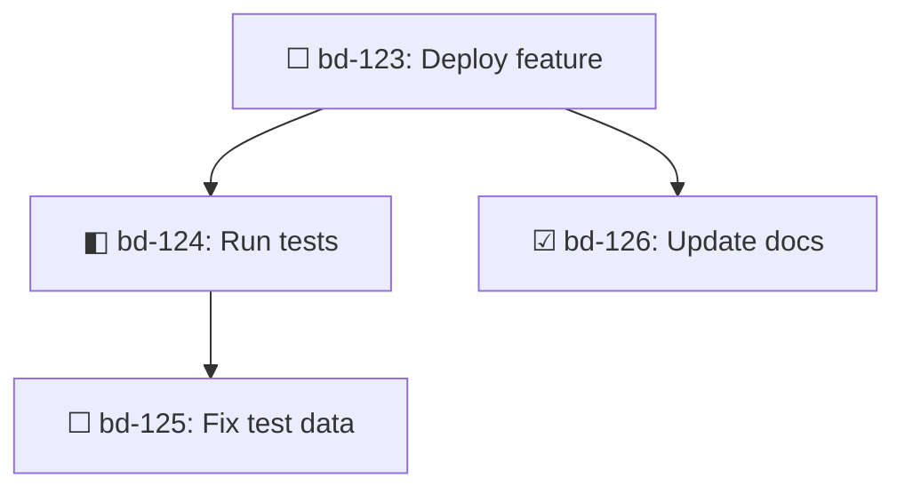

## Usage

```bash
bd dep [issue-id] [flags]
bd dep add <issue-id> <depends-on-id>
bd dep remove <issue-id> <depends-on-id>
bd dep list <issue-id>
bd dep tree <issue-id>
bd dep cycles
```

## Description

Manage dependencies between issues. Dependencies define blocking relationships, parent-child hierarchies, and other issue connections.

## Subcommands

### add

Add a dependency between two issues.

```bash
bd dep add <issue-id> <depends-on-id> [flags]
```

<ParamField path="issue-id" type="string" required>
  The dependent issue (the one that is blocked)
</ParamField>

<ParamField path="depends-on-id" type="string" required>
  The dependency (the blocker). Can be:
  - Local issue ID (e.g., `bd-xyz`)
  - External reference: `external:<project>:<capability>`
  Can also be specified via `--blocked-by` or `--depends-on` flag.
</ParamField>

<ParamField path="--type" type="string" default="blocks">
  Dependency type: `blocks`, `tracks`, `related`, `parent-child`, `discovered-from`, `until`, `caused-by`, `validates`, `relates-to`, `supersedes`
</ParamField>

<ParamField path="--blocked-by" type="string">
  Alternative to positional arg (same as `depends-on-id`)
</ParamField>

<ParamField path="--depends-on" type="string">
  Alias for `--blocked-by`
</ParamField>

### remove (rm)

Remove a dependency.

```bash
bd dep remove <issue-id> <depends-on-id>
```

### list

List dependencies or dependents of an issue.

```bash
bd dep list <issue-id> [flags]
```

<ParamField path="--direction" type="string" default="down">
  Direction: `down` (dependencies), `up` (dependents)
</ParamField>

<ParamField path="--type" type="string">
  Filter by dependency type
</ParamField>

### tree

Show dependency tree.

```bash
bd dep tree <issue-id> [flags]
```

<ParamField path="--direction" type="string" default="down">
  Direction: `down` (dependencies), `up` (dependents), `both` (full graph)
</ParamField>

<ParamField path="--max-depth" type="integer" default="50">
  Maximum tree depth to display
</ParamField>

<ParamField path="--status" type="string">
  Filter to only show issues with this status
</ParamField>

<ParamField path="--format" type="string">
  Output format: `mermaid` for Mermaid.js flowchart
</ParamField>

<ParamField path="--show-all-paths" type="boolean">
  Show all paths to nodes (no deduplication for diamond dependencies)
</ParamField>

### cycles

Detect dependency cycles.

```bash
bd dep cycles
```

## Examples

### Add Dependencies

<CodeGroup>
```bash Blocks Dependency
bd dep add bd-123 bd-124 --json
# bd-123 depends on (is blocked by) bd-124
```

```bash Using --blocks Flag
bd dep bd-124 --blocks bd-123 --json
# Equivalent: bd-124 blocks bd-123
```

```bash Using --blocked-by Flag
bd dep add bd-123 --blocked-by bd-124 --json
```

```bash Parent-Child
bd dep add bd-123 bd-parent --type parent-child --json
```

```bash Discovered-From
bd dep add bd-new-bug bd-investigation --type discovered-from --json
```
</CodeGroup>

### External Dependencies

<CodeGroup>
```bash Cross-Project
bd dep add gt-xyz external:beads:mol-run-assignee --json
# gt-xyz depends on beads project shipping mol-run-assignee capability
```

```bash Remove External Dependency
bd dep remove gt-xyz external:beads:mol-run-assignee --json
```
</CodeGroup>

### List Dependencies

<CodeGroup>
```bash What Blocks This Issue
bd dep list bd-123 --json
# Default: down direction (dependencies)
```

```bash What This Issue Blocks
bd dep list bd-123 --direction up --json
```

```bash Filter by Type
bd dep list bd-123 --direction up --type tracks --json
```
</CodeGroup>

### Dependency Tree

<CodeGroup>
```bash Show Blockers
bd dep tree bd-123 --json
```

```bash Show Dependents
bd dep tree bd-123 --direction up --json
```

```bash Full Graph
bd dep tree bd-123 --direction both --json
```

```bash Filter by Status
bd dep tree bd-123 --status open --json
```

```bash Mermaid Diagram
bd dep tree bd-123 --format mermaid
```
</CodeGroup>

### Cycle Detection

<CodeGroup>
```bash Check for Cycles
bd dep cycles --json
```
</CodeGroup>

## JSON Output

### dep add

```json
{
  "status": "added",
  "issue_id": "bd-123",
  "depends_on_id": "bd-124",
  "type": "blocks"
}
```

### dep list

```json
[
  {
    "id": "bd-124",
    "title": "Implement API endpoint",
    "status": "in_progress",
    "priority": 1,
    "dependency_type": "blocks"
  }
]
```

### dep tree

```json
[
  {
    "id": "bd-123",
    "title": "Deploy feature",
    "status": "open",
    "priority": 1,
    "depth": 0,
    "parent_id": "",
    "truncated": false
  },
  {
    "id": "bd-124",
    "title": "Run tests",
    "status": "in_progress",
    "priority": 1,
    "depth": 1,
    "parent_id": "bd-123",
    "truncated": false
  }
]
```

### dep cycles

```json
[
  [
    {
      "id": "bd-123",
      "title": "Issue A"
    },
    {
      "id": "bd-124",
      "title": "Issue B"
    }
  ]
]
```

## Dependency Types

<AccordionGroup>
  <Accordion title="blocks" icon="lock">
    **Blocking relationship**: Issue A depends on (is blocked by) Issue B. Issue A cannot be closed until B is closed.
    
    Default type when not specified.
  </Accordion>
  
  <Accordion title="parent-child" icon="sitemap">
    **Hierarchical relationship**: Used for epics and subtasks. Child issues inherit the parent's completion dependency.
    
    Created automatically with `--parent` flag in `bd create`.
  </Accordion>
  
  <Accordion title="discovered-from" icon="magnifying-glass">
    **Discovery tracking**: Links newly discovered issues to their source investigation.
    
    Example: Bug found during feature development.
  </Accordion>
  
  <Accordion title="tracks" icon="bullseye">
    **Tracking relationship**: Issue A tracks progress of Issue B (used in convoy patterns).
  </Accordion>
  
  <Accordion title="related" icon="link">
    **Informational link**: Issues are related but don't block each other. Bidirectional.
  </Accordion>
  
  <Accordion title="relates-to" icon="link">
    Alias for `related`
  </Accordion>
  
  <Accordion title="until" icon="clock">
    **Temporal dependency**: Issue A depends on B until a condition is met.
  </Accordion>
  
  <Accordion title="caused-by" icon="exclamation-triangle">
    **Causation tracking**: Issue A was caused by Issue B (e.g., bug caused by feature).
  </Accordion>
  
  <Accordion title="validates" icon="check-circle">
    **Validation relationship**: Issue A validates Issue B (e.g., test validates feature).
  </Accordion>
  
  <Accordion title="supersedes" icon="arrow-right">
    **Replacement relationship**: Issue A replaces Issue B.
  </Accordion>
</AccordionGroup>

## External References

External references allow cross-project dependencies:

### Format

```
external:<project>:<capability>
```

### Examples

```bash
# gastown depends on beads shipping a capability
bd dep add gt-xyz external:beads:mol-run-assignee

# beads depends on gastown feature
bd dep add bd-abc external:gastown:agent-dispatch
```

### Resolution

External refs are resolved at query time using `routes.jsonl` configuration:

1. Check if capability is "shipped" in target project
2. Block if not shipped
3. Unblock when shipped

<Info>
  External refs are stored as-is in the database. The `external_projects` config maps project names to their database locations.
</Info>

## Tree Visualization

### Terminal Output

```
🌲 Dependency tree for bd-123:

bd-123: Deploy feature [P1] (open) [BLOCKED]
├── bd-124: Run tests [P1] (in_progress)
│   └── bd-125: Fix test data [P2] (open)
└── bd-126: Update docs [P3] (closed) ✓
```

### Mermaid Diagram



## Cycle Detection

Cycles hide issues from ready work and cause confusion:

```bash
bd dep cycles
```

Output:
```
⚠ Found 1 dependency cycles:

1. Cycle involving:
   - bd-123: Issue A
   - bd-124: Issue B
   - bd-125: Issue C

Run 'bd dep tree bd-123' to visualize.
```

<Warning>
  Cycles prevent issues from appearing in `bd ready` even if they should be unblocked. Fix by removing one dependency in the cycle.
</Warning>

## Anti-Patterns

### Child→Parent Dependency

```bash
bd dep add bd-abc.1 bd-abc
# Error: bd-abc.1 is already a child of bd-abc
# Adding explicit dependency creates deadlock
```

Children inherit parent completion dependency via hierarchy. Explicit dependency creates:
- Child can't start (parent open)
- Parent can't close (children not done)
- Deadlock!

## Best Practices

### For Agents

1. **Use `discovered-from`** to link bugs found during work
2. **Check cycles** after adding dependencies
3. **Use external refs** for cross-project dependencies
4. **Verify dependencies exist** before adding

### For Humans

1. **Keep dependency types semantic** (blocks for blocking, tracks for tracking)
2. **Use parent-child** for true hierarchies
3. **Avoid deep trees** (>5 levels) - flatten if possible
4. **Document external refs** in issue description

### Dependency Hygiene

```bash
# Before closing an issue, check what it blocks
bd dep list bd-123 --direction up --json

# After closing, verify nothing is wrongly blocked
bd blocked --json
```

## Related Commands

- [`bd ready`](/cli/ready) - Find unblocked work
- [`bd blocked`](/cli/ready#blocked) - Show blocked issues
- [`bd create --deps`](/cli/create) - Create with dependencies
- [`bd update --parent`](/cli/update) - Reparent issues
