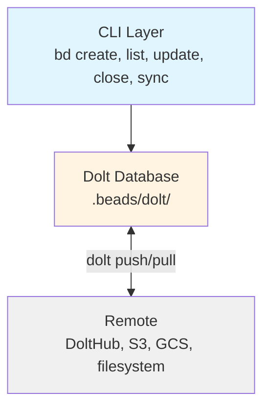
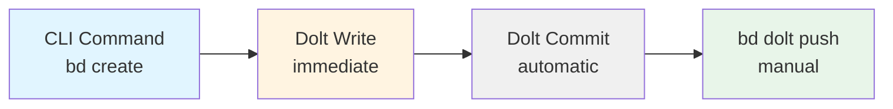
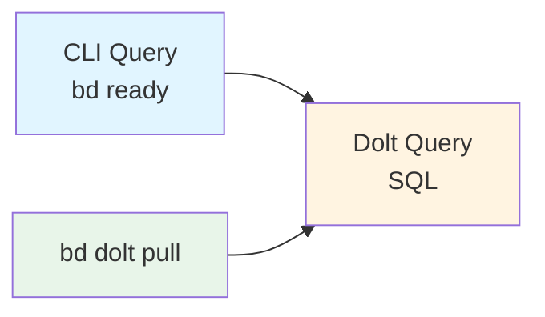
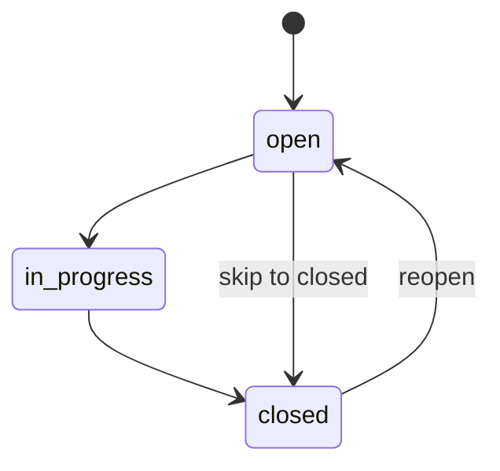

Beads uses a two-layer architecture that combines the speed of a local database with the reliability of version control, enabling distributed, git-backed issue tracking that feels like a centralized system.

## The Two-Layer Data Model

Beads' core design provides a distributed, git-backed issue tracker with two synchronized layers:



### CLI Layer

**All commands** (`bd create`, `bd list`, `bd update`, `bd close`, etc.) interface directly with the database:
- Built with Cobra framework in `cmd/bd/`
- All commands support `--json` for programmatic use
- Direct database access (server mode or embedded mode)
- No special sync commands needed

### Dolt Database

**Storage backend** at `.beads/dolt/`:
- Version-controlled SQL database with cell-level merge
- Server mode (multi-writer) or embedded mode (single-writer)
- Fast queries with indexes and foreign keys
- Stores issues, dependencies, labels, comments, events
- Automatic Dolt commits on every write
- Native push/pull to Dolt remotes

### Remote Sync

**Dolt remotes** (DoltHub, S3, GCS, filesystem):
- All collaborators share the same issue database
- Cell-level merge for automatic conflict resolution
- Protected branch support via separate sync branch
- No special sync server needed

## Why This Design?

### Dolt for Versioned SQL

Queries complete in **milliseconds** with full SQL support. Dolt adds native version control:
- Every write automatically committed to Dolt history
- Complete audit trail
- Cell-level merge resolves conflicts automatically

### Dolt for Distribution

- Native push/pull to Dolt remotes
- Issues travel with your code
- Offline work just works
- No special sync server needed

### Import/Export for Portability

`bd import` and `bd export` support JSONL format for:
- Data migration
- Bootstrapping new clones
- Interoperability with other systems

## Write Path

When you create or modify an issue:



1. **Command executes:** `bd create "New feature"` writes to Dolt immediately
2. **Dolt commit:** Every write is automatically committed to Dolt history
3. **Sync:** Use `bd dolt push` to share changes with Dolt remotes

<CodeGroup>
```bash Create and sync
bd create "Add OAuth support" -p 1
# Auto-committed to Dolt history

bd dolt push
# Pushed to remote
```

```bash Batch operations
bd create "Setup database" -p 0
bd create "Add tests" -p 1
bd create "Update docs" -p 2
# Each command auto-commits

bd dolt push
# All changes pushed together
```
</CodeGroup>

## Read Path

All queries run directly against the local Dolt database:



1. **Query:** Commands read from fast local Dolt database via SQL
2. **Sync:** Use `bd dolt pull` to fetch updates from Dolt remotes

<CodeGroup>
```bash Query local data
bd ready
bd list --status open
bd show bd-a1b2
# All queries hit local database
```

```bash Sync from remote
bd dolt pull
# Fetch latest changes

bd ready
# See updated work
```
</CodeGroup>

## Hash-Based Collision Prevention

The key insight enabling distributed operation: **content-based hashing for deduplication**.

### The Problem

Sequential IDs (`bd-1`, `bd-2`, `bd-3`) cause collisions when multiple agents create issues concurrently:

```
Branch A: bd create "Add OAuth"   → bd-10  ❌
Branch B: bd create "Add Stripe"  → bd-10  ❌ collision!
```

### The Solution

Hash-based IDs derived from random UUIDs ensure uniqueness:

```
Branch A: bd create "Add OAuth"   → bd-a1b2  ✓
Branch B: bd create "Add Stripe"  → bd-f14c  ✓ no collision
```

### How It Works

<Steps>
  <Step title="Issue creation">
    Generate random UUID, derive short hash as ID
  </Step>
  <Step title="Progressive scaling">
    IDs start at 4 chars, grow to 5-6 chars as database grows
  </Step>
  <Step title="Content hashing">
    Each issue has a content hash for change detection
  </Step>
  <Step title="Import merge">
    Same ID + different content = update, same ID + same content = skip
  </Step>
</Steps>

This eliminates the need for central coordination while ensuring all machines converge to the same state.

<Note>
See `COLLISION_MATH.md` for birthday paradox calculations on hash length vs collision probability.
</Note>

## Server Architecture

Each workspace can run its own Dolt server for multi-writer access:

<Tabs>
  <Tab title="Server Mode">
    Connects to `dolt sql-server` for multi-writer, high-concurrency access:
    
    - PID file at `.beads/dolt/sql-server.pid`
    - Logs at `.beads/dolt/sql-server.log`
    - Protocol defined in `internal/rpc/protocol.go`
    
    ```bash
    # Start server (Gas Town)
    gt dolt start
    
    # Or manually
    cd ~/.dolt-data/beads && dolt sql-server --port 3307
    ```
  </Tab>
  
  <Tab title="Embedded Mode">
    Direct database access for single-writer scenarios:
    
    - No server process needed
    - Zero ops: no daemon, no ports, no PID files
    - Default for standalone users
    
    ```bash
    # Just initialize and go
    bd init
    bd create "First issue"
    ```
  </Tab>
</Tabs>

## Data Types

Core types defined in `internal/types/types.go`:

| Type | Description | Key Fields |
|------|-------------|------------|
| **Issue** | Work item | ID, Title, Description, Status, Priority, Type |
| **Dependency** | Relationship between issues | FromID, ToID, Type (blocks/related/parent-child/discovered-from) |
| **Label** | Tag/category | Name, Color, Description |
| **Comment** | Discussion thread | IssueID, Author, Content, Timestamp |
| **Event** | Audit trail entry | IssueID, Type, Data, Timestamp |

### Issue Status Flow



- **open**: Ready to work on
- **in_progress**: Actively being worked on
- **closed**: Completed
- **blocked**: Has open blocking dependencies
- **deferred**: Postponed for later

## Directory Structure

```
.beads/
├── dolt/             # Dolt database, sql-server.pid, sql-server.log (gitignored)
├── metadata.json     # Backend config (local, gitignored)
└── config.yaml       # Project config (optional, committed)
```

<Warning>
The `.beads/dolt/` directory is gitignored. Only sync via Dolt push/pull, not git.
</Warning>

## Key Code Paths

| Area | Files |
|------|-------|
| CLI entry | `cmd/bd/main.go` |
| Storage interface | `internal/storage/storage.go` |
| Dolt implementation | `internal/storage/dolt/` |
| RPC protocol | `internal/rpc/protocol.go`, `server_*.go` |
| Export logic | `cmd/bd/export.go` |
| Import logic | `cmd/bd/import.go` |

## Related Documentation

<CardGroup cols={2}>
  <Card title="Dependencies" icon="link" href="/concepts/dependencies">
    Learn about dependency types and how they affect workflow
  </Card>
  
  <Card title="Workflows" icon="diagram-project" href="/concepts/workflows">
    Understand contributor, stealth, and maintainer modes
  </Card>
  
  <Card title="Memory" icon="brain" href="/concepts/memory">
    Persistent agent knowledge across sessions
  </Card>
  
  <Card title="Dolt Backend" icon="database" href="/reference/dolt">
    Deep dive into Dolt configuration and features
  </Card>
</CardGroup>