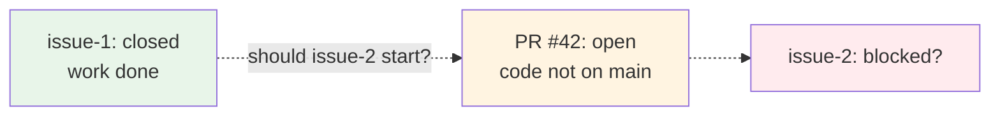

Beads includes a comprehensive dependency system for ordering work, tracking relationships, and managing external conditions through gates.

## Adding Dependencies

Create a dependency relationship between two issues:

<CodeGroup>
```bash Basic syntax
# issue-2 depends on issue-1 (issue-1 blocks issue-2)
bd dep add issue-2 issue-1
```

```bash Shorthand flags
# issue-1 blocks issue-2
bd dep issue-1 --blocks issue-2

# Alternative flags (all equivalent)
bd dep add issue-2 --blocked-by issue-1
bd dep add issue-2 --depends-on issue-1
```
</CodeGroup>

When `issue-1` is open, `issue-2` won't appear in `bd ready`. Once `issue-1` closes, `issue-2` unblocks automatically.

## Removing Dependencies

```bash
bd dep remove issue-2 issue-1
bd dep rm issue-2 issue-1        # alias
```

## Dependency Types

Dependencies have a **type** that determines whether they block work:

### Blocking Types

These affect what appears in `bd ready`:

| Type | Meaning | Example Use Case |
|------|---------|------------------|
| `blocks` (default) | B cannot start until A closes | Sequential task ordering |
| `parent-child` | Children blocked when parent blocked | Epic hierarchies |
| `conditional-blocks` | B runs only if A fails | Error handling paths |
| `waits-for` | B waits for all of A's children | Fanout aggregation |

<CodeGroup>
```bash Default blocks
# Task ordering - implement before testing
bd dep add test-feature implement-feature
```

```bash Parent-child
# Epic with subtasks
bd create "Auth System" -t epic
bd create "OAuth flow" --parent auth-epic
bd create "Session management" --parent auth-epic
```
</CodeGroup>

### Non-Blocking Types

These are graph annotations only (informational):

| Type | Meaning | When to Use |
|------|---------|-------------|
| `related` | Informational link | Related context |
| `tracks` | Progress tracking | Monitor another issue |
| `discovered-from` | Found during work | Side quests, bugs found |
| `caused-by` | Root cause link | Link bug to cause |
| `validates` | Test or verification | Link test to feature |
| `supersedes` | Replaces another issue | Duplicate resolution |

<CodeGroup>
```bash Discovered work
# Found a bug while working on feature
bd create "Fix auth timeout" -t bug -p 1 \
  --deps discovered-from:bd-a1b2
```

```bash Related context
# Link related issues
bd dep add new-feature old-feature --type relates_to
```

```bash Custom type
# Specify any dependency type
bd dep add issue-2 issue-1 --type tracks
bd dep add bug-fix root-cause --type caused-by
```
</CodeGroup>

## Finding Ready Work

`bd ready` shows issues with **no open blocking dependencies**:

<CodeGroup>
```bash Basic ready
bd ready
```

```bash Filter ready work
bd ready --priority 1              # By priority
bd ready --label backend           # By label
bd ready --assignee alice          # By assignee
bd ready --unassigned              # Unassigned only
bd ready --type task               # By issue type
bd ready --sort oldest             # Oldest first
```
</CodeGroup>

<Info>
An issue is ready when **ALL** of its blocking dependencies are closed.
</Info>

### Example Output

```
📋 Ready work (3 issues with no blockers):

1. [P0] bd-a1b2: Set up database schema
   Priority: 0 | Type: task | Created: 2 days ago

2. [P1] bd-c3d4: Add authentication
   Priority: 1 | Type: feature | Created: 1 day ago

3. [P1] bd-e5f6: Write integration tests
   Priority: 1 | Type: task | Created: 3 hours ago
```

## Viewing Blocked Issues

See what's blocked and why:

```bash
bd blocked
```

Shows every blocked issue and what blocks it. Use after closing an issue to see what just unblocked.

### Example Output

```
🚧 Blocked issues (2):

bd-g7h8: Deploy to production
  Blocked by:
  - bd-a1b2: Set up database schema [open]
  - bd-c3d4: Add authentication [in_progress]

bd-i9j0: Update documentation
  Blocked by:
  - bd-e5f6: Write integration tests [open]
```

## Visualizing Dependencies

### Dependency Tree

View hierarchical dependency structure:

<CodeGroup>
```bash Basic tree
bd dep tree issue-id
```

```bash Direction options
bd dep tree issue-id --direction=down    # What does this depend on?
bd dep tree issue-id --direction=up      # What depends on this?
bd dep tree issue-id --direction=both    # Both directions
```

```bash Filtering
bd dep tree issue-id --status=open       # Only open issues
bd dep tree issue-id --max-depth=3       # Limit depth
bd dep tree issue-id --format=mermaid    # Mermaid.js output
```
</CodeGroup>

### Dependency Graph

Visualize the entire dependency graph:

<CodeGroup>
```bash Graph views
bd graph issue-id                        # Single issue DAG
bd graph --all                           # All open issues
```

```bash Output formats
bd graph --compact issue-id              # One line per issue
bd graph --box issue-id                  # ASCII boxes with layers
bd graph --dot issue-id | dot -Tsvg > graph.svg   # Graphviz
bd graph --html issue-id > graph.html    # Interactive D3.js
```
</CodeGroup>

The graph organizes issues into **layers**:

- **Layer 0**: No dependencies (can start immediately)
- **Layer 1**: Depends on layer 0
- **Higher layers**: Depend on lower layers
- **Same layer**: Can run in parallel

### Dependency List

Simple text list of dependencies:

```bash
bd dep list issue-id                     # What does this depend on?
bd dep list issue-id --direction=up      # What depends on this?
bd dep list issue-id --type=tracks       # Filter by type
```

## Cycle Detection

Beads prevents circular dependencies:

```bash
# Check for cycles
bd dep cycles
```

<Warning>
Beads rejects cycles at write time — `bd dep add` checks for cycles before committing.
</Warning>

## Cross-Repo Dependencies

Reference issues in other beads rigs:

```bash
bd dep add local-issue external:other-project:remote-issue
```

<Info>
External dependencies always block. When the remote issue closes, `bd ready` reflects the change (checked at query time).
</Info>

## Gates

Gates are **special issues** that block dependent work until an external condition is met. They bridge the gap between beads (which tracks work) and external systems (which track code, CI, or time).

### The Problem Gates Solve

When you use Dolt, issue state is decoupled from code state. Closing a beads issue means "work is done" but the code may still be on a feature branch:



With file-based storage (JSONL), issue updates land atomically with code. With Dolt, they don't. **Gates solve this** by making the dependency wait for the external condition — not just the beads issue status.

### Gate Types

| Type | Condition | Auto-Resolution |
|------|-----------|----------------|
| `gh:pr` | PR merged | `gh pr view` returns MERGED |
| `gh:run` | CI passes | `gh run view` returns completed + success |
| `timer` | Time elapsed | Current time exceeds timeout |
| `bead` | Cross-rig issue closed | Remote bead status checked |
| `human` | Manual approval | `bd gate resolve <id>` |

### Creating Gates

<CodeGroup>
```bash PR gate
# Wait for PR #42 to merge
bd create --type=gate --title="Wait for PR #42" \
  --await-type=gh:pr --await-id=42
```

```bash CI gate
# Wait for CI run
bd create --type=gate --title="Wait for CI" \
  --await-type=gh:run --await-id=12345
```

```bash Timer gate
# Wait 30 minutes
bd create --type=gate --title="Cooldown" \
  --await-type=timer --await-id=30m
```

```bash Manual gate
# Manual approval gate
bd create --type=gate --title="Deploy approval"
```
</CodeGroup>

### Wiring Gates

A gate is an issue. Wire it into the dependency graph:

```bash
# issue-2 waits for the gate (which waits for PR #42)
bd dep add issue-2 <gate-id>
```

### Checking Gates

`bd gate check` evaluates all open gates and closes resolved ones:

<CodeGroup>
```bash Check all gates
bd gate check
```

```bash Filtered checks
bd gate check --type=gh:pr       # Only PR gates
bd gate check --type=gh:run      # Only CI gates
bd gate check --type=timer       # Only timers
bd gate check --dry-run          # Preview without changes
bd gate check --escalate         # Escalate failed gates
```
</CodeGroup>

<Tip>
Escalation marks gates whose conditions failed (e.g., PR closed without merge, CI run failed) so they surface for attention.
</Tip>

### Manual Resolution

For `human` gates or overrides:

```bash
bd gate resolve <gate-id> --reason "Approved by team lead"
```

### Automating Gate Checks

Run `bd gate check` periodically:

- **CI step**: Add to your GitHub Actions workflow
- **Cron**: `*/5 * * * * cd /path/to/repo && bd gate check`
- **Agent hook**: Run at session start or after PR operations

## Common Patterns

### PR Merge Gate

Agent finishes work, opens PR, creates a gate so follow-up work waits for merge:

<CodeGroup>
```bash Agent A workflow
bd update issue-1 --status=in_progress
# ... write code, open PR #42 ...

bd create --type=gate --title="Wait for PR #42" \
  --await-type=gh:pr --await-id=42

bd dep add issue-2 <gate-id>
bd close issue-1
```

```bash Agent B workflow
bd ready                         # issue-2 not shown (gate open)

# ... PR #42 merges ...
bd gate check                    # gate closes
bd ready                         # issue-2 appears!
```
</CodeGroup>

### Epic with Ordered Phases

```bash
bd create "Auth System" -t epic
bd create "Design" --parent <epic>
bd create "Implement" --parent <epic>
bd create "Test" --parent <epic>

bd dep add <implement> <design>
bd dep add <test> <implement>

bd dep tree <epic>
bd ready                         # Only "Design" is ready
```

### Parallel Work Streams

```bash
# Backend and frontend can work in parallel
bd create "Backend API" -p 1
bd create "Frontend UI" -p 1
bd create "Integration" -p 1

# Integration waits for both
bd dep add integration backend-api
bd dep add integration frontend-ui

bd ready  # Shows backend-api AND frontend-ui (parallel)
```

## Best Practices

<AccordionGroup>
  <Accordion title="Use blocking types sparingly">
    Only use `blocks` when work truly cannot proceed. Overuse creates unnecessary bottlenecks.
  </Accordion>
  
  <Accordion title="Link discovered work">
    Always use `discovered-from` when finding bugs or tasks during other work. This preserves context.
  </Accordion>
  
  <Accordion title="Check bd blocked after closing">
    After closing an issue, run `bd blocked` to see what just unblocked.
  </Accordion>
  
  <Accordion title="Use gates for external dependencies">
    Don't close issues before code is merged. Use gates to wait for PR merge or CI success.
  </Accordion>
  
  <Accordion title="Visualize before large changes">
    Run `bd graph --all` before major dependency changes to understand impact.
  </Accordion>
</AccordionGroup>

## Related Documentation

<CardGroup cols={2}>
  <Card title="Architecture" icon="sitemap" href="/concepts/architecture">
    Understand the two-layer data model
  </Card>
  
  <Card title="Workflows" icon="diagram-project" href="/concepts/workflows">
    Learn about contributor, stealth, and maintainer modes
  </Card>
  
  <Card title="CLI Reference" icon="terminal" href="/reference/cli">
    Complete command documentation
  </Card>
  
  <Card title="Gates Deep Dive" icon="door-open" href="/advanced/gates">
    Advanced gate patterns and automation
  </Card>
</CardGroup>