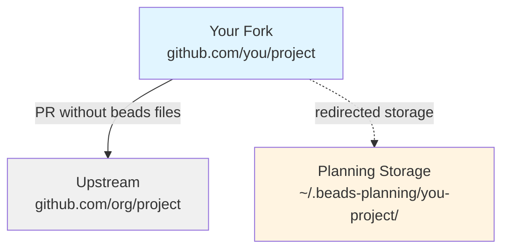

Beads supports different workflow modes to handle various collaboration scenarios, from solo local work to multi-contributor open-source projects.

## Workflow Modes Overview

| Mode | Use Case | Beads Location | Git Integration |
|------|----------|----------------|----------------|
| **Standard** | Default mode | `.beads/` (committed) | Full git integration |
| **Stealth** | Local-only work | `.beads/` (gitignored) | No git integration |
| **Contributor** | Fork with planning | `~/.beads-planning/` | Redirected storage |
| **Maintainer** | Repo with write access | `.beads/` (committed) | Full git integration |

## Standard Mode

The default mode for most projects:

<CodeGroup>
```bash Initialize
bd init
```

```bash What happens
# Creates .beads/ directory
# Commits to git (issues travel with code)
# Full Dolt sync via bd dolt push/pull
```
</CodeGroup>

### When to Use

<Check>Solo projects or small teams</Check>
<Check>Issues should be versioned with code</Check>
<Check>Everyone has write access to the repo</Check>

### Characteristics

- `.beads/` directory is committed to git
- Issues sync via Dolt push/pull
- Full git integration (hooks, branches)
- Issues visible to all collaborators

## Stealth Mode

**Local-only** work without committing files to the main repo:

<CodeGroup>
```bash Initialize
bd init --stealth
```

```bash What happens
# Creates .beads/ directory (gitignored)
# Local database only
# No git integration
```
</CodeGroup>

### When to Use

<Check>Personal task tracking on shared projects</Check>
<Check>Don't want to clutter repo with issue tracking</Check>
<Check>Experimenting with beads before team adoption</Check>
<Check>Contributing to projects that don't use beads</Check>

### Characteristics

- `.beads/` added to `.gitignore` automatically
- Database stays local (no push/pull)
- No git hooks or integration
- Perfect for personal use

<Info>
Stealth mode is ideal for trying beads on existing projects without affecting other team members.
</Info>

### Example: Personal Task Tracking

```bash
# Clone a project
git clone https://github.com/company/project
cd project

# Initialize stealth mode
bd init --stealth

# Track your personal work
bd create "Understand auth flow" -p 1
bd create "Fix bug in validator" -p 0
bd create "Refactor tests" -p 2

# Git status shows no beads files
git status  # Clean working directory
```

## Contributor Mode

**Fork workflow** that routes planning issues to a separate repo:

<CodeGroup>
```bash Initialize
bd init --contributor
```

```bash What happens
# Redirects storage to ~/.beads-planning/
# Keeps experimental work out of PRs
# Full issue tracking without cluttering fork
```
</CodeGroup>

### When to Use

<Check>Contributing to open-source projects</Check>
<Check>Working on a fork without write access</Check>
<Check>Want to use beads for planning without affecting PR</Check>

### How It Works



### Characteristics

- Issues stored in `~/.beads-planning/`
- `.beads/` directory not created in repo
- PRs remain clean (no beads files)
- Full issue tracking for your planning

### Example: Contributing to Open Source

<Steps>
  <Step title="Fork and clone">
    ```bash
    git clone https://github.com/you/some-project
    cd some-project
    ```
  </Step>
  
  <Step title="Initialize contributor mode">
    ```bash
    bd init --contributor
    # Storage redirected to ~/.beads-planning/you-some-project/
    ```
  </Step>
  
  <Step title="Track your work">
    ```bash
    bd create "Fix issue #123" -p 1
    bd create "Add tests for new feature" -p 1
    bd dep add tests fix
    
    bd ready  # See your planned work
    ```
  </Step>
  
  <Step title="Submit clean PR">
    ```bash
    git add .
    git status  # No .beads/ files!
    git commit -m "Fix issue #123"
    git push origin feature-branch
    # PR is clean, no beads files included
    ```
  </Step>
</Steps>

<Warning>
Contributor mode keeps your planning private. If you want to share issues with maintainers, use standard mode instead.
</Warning>

## Maintainer Mode

For repositories where you have **write access**:

<CodeGroup>
```bash Auto-detected
# Beads auto-detects maintainer role via SSH URLs
git clone git@github.com:you/project.git
bd init  # Automatically uses maintainer mode
```

```bash Manual configuration
# If using HTTPS without credentials but you have write access
git config beads.role maintainer
```
</CodeGroup>

### When to Use

<Check>You have write access to the repository</Check>
<Check>Team uses beads for issue tracking</Check>
<Check>Issues should be shared with all contributors</Check>

### Characteristics

- Same as standard mode
- Auto-detected via SSH URLs or HTTPS with credentials
- Issues committed to repo
- Full Dolt sync capabilities

<Tip>
Maintainer mode is usually auto-detected. Only configure manually if using HTTPS without credentials.
</Tip>

## Switching Between Modes

### Stealth → Standard

```bash
# Move from local-only to committed
rm .gitignore  # Remove beads exclusion
git add .beads/
git commit -m "Add beads tracking"
bd dolt push  # Enable sync
```

### Standard → Stealth

```bash
# Move to local-only
echo ".beads/" >> .gitignore
git rm -r --cached .beads/
git commit -m "Remove beads from version control"
```

### Contributor → Standard

```bash
# Stop redirection, use local storage
rm .beads/metadata.json  # Remove redirect config
bd init  # Re-initialize as standard
# Manually import from ~/.beads-planning/ if needed
```

## Hierarchical IDs

All modes support hierarchical IDs for organizing work:

```
bd-a3f8       (Epic)
├── bd-a3f8.1     (Task)
│   ├── bd-a3f8.1.1 (Sub-task)
│   └── bd-a3f8.1.2 (Sub-task)
└── bd-a3f8.2     (Task)
```

<CodeGroup>
```bash Create hierarchy
bd create "Auth System" -t epic
# Returns: bd-a3f8

bd create "OAuth flow" --parent bd-a3f8
# Returns: bd-a3f8.1

bd create "Session management" --parent bd-a3f8
# Returns: bd-a3f8.2
```

```bash Query by prefix
# Show entire epic tree
bd list --prefix bd-a3f8

# Show specific subtree
bd list --prefix bd-a3f8.1
```
</CodeGroup>

## Agent Workflows

Beads is optimized for AI-supervised coding workflows:

### Standard Agent Flow

<Steps>
  <Step title="Find ready work">
    ```bash
    bd ready --json
    ```
    Shows issues with no open blockers
  </Step>
  
  <Step title="Claim atomically">
    ```bash
    bd update <id> --claim --json
    ```
    Sets assignee + status=in_progress in one operation
  </Step>
  
  <Step title="Work on it">
    Implement, test, document the feature or fix
  </Step>
  
  <Step title="Discover new work">
    ```bash
    bd create "Found bug" -t bug -p 1 \
      --deps discovered-from:<parent-id> --json
    ```
    Link discovered work back to parent
  </Step>
  
  <Step title="Complete">
    ```bash
    bd close <id> --reason "Completed" --json
    ```
  </Step>
  
  <Step title="Check unblocked">
    ```bash
    bd ready --json
    ```
    See what became available
  </Step>
</Steps>

### Agent Memory with `bd prime`

`bd prime` outputs essential workflow context for AI agents:

```bash
bd prime
```

Designed for Claude Code hooks (`SessionStart`, `PreCompact`) to prevent agents from forgetting bd workflow after context compaction.

<Accordion title="Customizing prime output">
  Place a `.beads/PRIME.md` file to override default output:
  
  ```bash
  # Export default for customization
  bd prime --export > .beads/PRIME.md
  
  # Edit to your preferences
  vim .beads/PRIME.md
  
  # Future bd prime calls use your custom version
  bd prime
  ```
</Accordion>

### Session Completion Protocol

When ending an agent session:

<Steps>
  <Step title="File remaining work">
    ```bash
    bd create "Follow-up task" -t task -p 2 --json
    ```
  </Step>
  
  <Step title="Run quality gates">
    ```bash
    make test
    make lint
    ```
  </Step>
  
  <Step title="Update issue status">
    ```bash
    bd close <id> --reason "Completed" --json
    ```
  </Step>
  
  <Step title="Push to remote (MANDATORY)">
    ```bash
    git pull --rebase
    git push
    git status  # Must show "up to date with origin"
    ```
  </Step>
  
  <Step title="Sync Dolt">
    ```bash
    bd dolt push
    ```
  </Step>
</Steps>

<Warning>
Work is NOT complete until `git push` succeeds. Never end a session before pushing.
</Warning>

## Configuration

Configure workflow behavior via `.beads/config.yaml`:

```yaml
# Disable git operations in session close
no-git-ops: true

# Set role explicitly
beads:
  role: maintainer  # or contributor

# Stealth mode detection
git:
  ignore-beads: true
```

### Environment Variables

| Variable | Purpose |
|----------|---------|
| `BEADS_DIR` | Override `.beads` location |
| `BEADS_ROLE` | Force role (contributor/maintainer) |
| `BD_NO_GIT_OPS` | Disable git operations |

## Best Practices

<AccordionGroup>
  <Accordion title="Choose the right mode">
    - **Solo/small team**: Standard mode
    - **Personal tracking**: Stealth mode
    - **Open source fork**: Contributor mode
    - **Repo maintainer**: Maintainer mode (auto-detected)
  </Accordion>
  
  <Accordion title="Use discovered-from links">
    Always link side quests and bugs back to parent work:
    ```bash
    bd create "Bug found" --deps discovered-from:bd-parent
    ```
  </Accordion>
  
  <Accordion title="Sync regularly">
    In standard/maintainer mode, sync often:
    ```bash
    bd dolt pull   # Before starting work
    bd dolt push   # After completing work
    ```
  </Accordion>
  
  <Accordion title="Clean PRs in contributor mode">
    Always verify no beads files in PRs:
    ```bash
    git status  # Should show no .beads/ files
    ```
  </Accordion>
</AccordionGroup>

## Related Documentation

<CardGroup cols={2}>
  <Card title="Architecture" icon="sitemap" href="/concepts/architecture">
    Understand the two-layer data model
  </Card>
  
  <Card title="Dependencies" icon="link" href="/concepts/dependencies">
    Learn about blocking and non-blocking relationships
  </Card>
  
  <Card title="Memory" icon="brain" href="/concepts/memory">
    Persistent agent knowledge across sessions
  </Card>
  
  <Card title="Protected Branches" icon="code-branch" href="/advanced/protected-branches">
    Advanced sync branch configuration
  </Card>
</CardGroup>